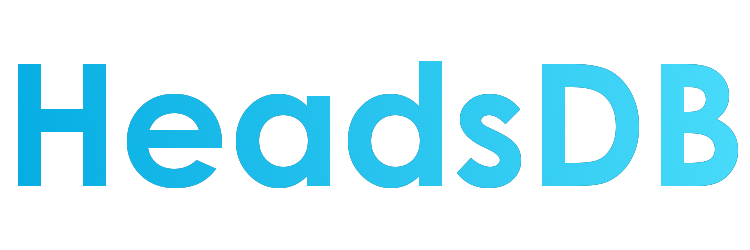

What is this?
------------------------------

This project is an additional plugin for the Heads plugin. (Which can be
found [here](https://github.com/KCodeYT/Heads/))
This plugin adds a database to the Heads plugin, so you can access more heads.

How can I download this plugin?
------------------------------

You can find the downloads on the [releases section](https://github.com/KCodeYT/HeadsDatabase/releases) of this github
page.
There you can find the LATEST jar file of this plugin.

How can I access the database?
------------------------------

    1. Open the chat in your client.
    2. Ensure you have the operator status on the server or have the permission "headsdb.command.hdb", 
       otherwise you will not be able to use this command.
    3. Type /hdb.
    4. You now see a GUI in which you can select a category of heads that are in the database.
    5. Select a category and you can select a head from that category.
    6. By selecting a head, the head will be given to you.